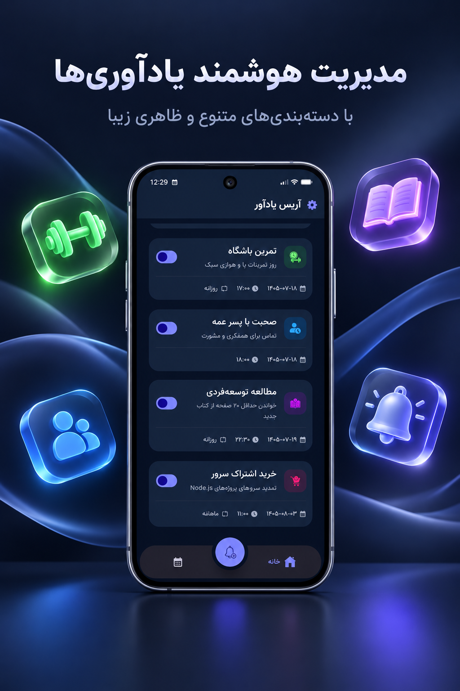
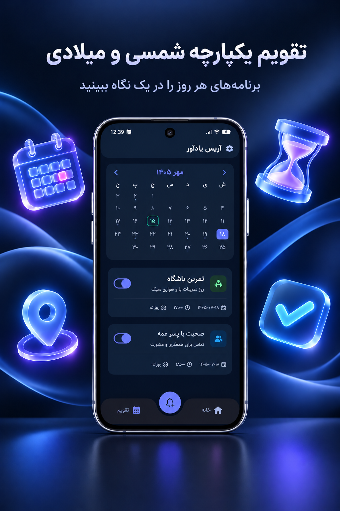
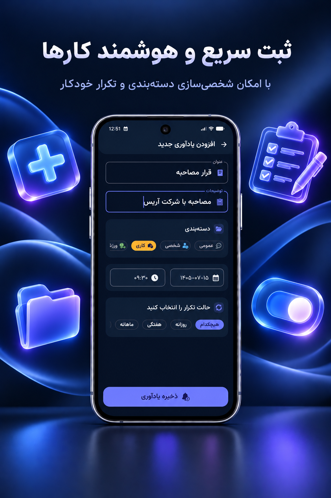

<p align="center">
  
</p>

<h1 align="center">🔔 Arys Reminder</h1>

<p align="center">
  <strong>A modern Android reminder and task management application</strong>
</p>

<p align="center">
  Built with Kotlin, Jetpack Compose and modern Android development practices.
</p>

<p align="center">
  <a href="https://cafebazaar.ir/app/com.arysapp.reminder">
    
  </a>
</p>

<p align="center">
  
  
  
</p>

---

## 📱 About

**Arys Reminder** is a modern Android application designed to help users manage
their daily tasks, appointments, important events and recurring reminders.

The application was designed and developed as a real-world Android project,
with a focus on maintainable architecture, modern UI development,
local data management and reliable reminder scheduling.

The project is also **published and publicly available on Cafe Bazaar**.

### ✨ Key Features

- 🔔 Create and manage reminders
- 📅 Jalali (Persian) and Gregorian calendar support
- ⏰ Precise date and time selection
- 🔁 One-time reminders
- 🔄 Daily recurring reminders
- 📆 Weekly recurring reminders
- 🗓️ Monthly recurring reminders
- 🎂 Yearly recurring reminders
- 🔕 Enable / disable reminders
- 📢 Advance reminder notifications
- 🌐 Persian and English localization
- 🌙 Light and Dark themes
- ✨ Modern Material 3 interface
- 🎬 Smooth UI animations
- 📱 Responsive Compose UI
- ⚡ Lightweight and fully local

---

## 🖼️ Screenshots

<p align="center">
  
  
  
  
</p>

---

## 🏗️ Architecture

Arys Reminder follows a layered architecture designed around
**separation of concerns, testability and maintainability**.

The project uses:

- **MVVM**
- **Clean Architecture principles**
- **SOLID principles**
- **Repository pattern**
- **Dependency Injection**
- **Unidirectional data flow where applicable**

The application separates presentation, domain and data responsibilities
to keep business logic independent from Android UI implementation details.

### High-Level Architecture

```text
┌─────────────────────────────┐
│         Presentation        │
│                             │
│  Jetpack Compose            │
│  ViewModels                 │
│  UI State                   │
└──────────────┬──────────────┘
               │
               ▼
┌─────────────────────────────┐
│           Domain            │
│                             │
│  Use Cases                  │
│  Business Rules             │
│  Domain Models              │
└──────────────┬──────────────┘
               │
               ▼
┌─────────────────────────────┐
│            Data             │
│                             │
│  Repository Implementations │
│  Local Data Source          │
│  Reminder Scheduling        │
└─────────────────────────────┘
````

This structure makes individual responsibilities easier to test,
maintain and extend.

---

## 🧩 Tech Stack

### Language

* Kotlin

### UI

* Jetpack Compose
* Material 3
* AndroidX
* Custom Compose components
* Animations

### Architecture

* MVVM
* Clean Architecture
* SOLID
* Repository Pattern
* Dependency Injection

### Android

* Android SDK
* AndroidX
* Notifications
* Alarm scheduling
* Runtime permission handling

### Local Storage

* Room
* DataStore

### Asynchronous Programming

* Kotlin Coroutines
* Flow

### Testing

* JUnit
* Android instrumentation tests
* UI testing

---

## 🔔 Reminder Scheduling

One of the technically important parts of Arys Reminder is reminder
scheduling.

The application needs to convert a user's reminder configuration into a
reliable scheduled event while supporting:

* One-time reminders
* Daily recurrence
* Weekly recurrence
* Monthly recurrence
* Yearly recurrence
* Advance notifications
* Notification delivery
* Reminder state management

The scheduling layer is intentionally separated from the UI so that
reminder creation and reminder execution are not tightly coupled to
Compose screens.

> Android's background execution, Doze Mode, exact alarm permissions and
> OEM-specific battery management can affect reminder delivery. The
> application therefore relies on Android's supported scheduling APIs
> rather than assuming unrestricted background execution.

---

## 🌍 Localization

Arys Reminder supports:

* 🇮🇷 Persian
* 🇬🇧 English

The application also supports both:

* Jalali / Persian calendar
* Gregorian calendar

Localization was considered at the UI and data presentation levels so that
date, text direction and user-facing content can adapt to the selected
language.

---

## 🎨 UI / UX

The UI was implemented entirely with **Jetpack Compose**.

The design focuses on:

* Clear visual hierarchy
* Minimal interaction steps
* Consistent spacing
* Material 3 components
* Responsive layouts
* Light / Dark themes
* Smooth transitions and animations
* Persian RTL support

The project went through a UI redesign to improve the overall user
experience and make the application feel closer to a production-ready
Android product rather than a basic prototype.

---

## 🧪 Testing

The project includes automated tests for important application logic and
UI behaviour.

Testing was used to validate:

* Reminder creation
* Reminder updates
* Reminder deletion
* Recurrence logic
* Date/time handling
* Core business logic
* UI interactions

The goal is to reduce regressions when modifying reminder behaviour or
introducing new features.

---

## 🚀 Release

Arys Reminder is not only a sample project.

It has been packaged, signed and published as a production Android
application.

### Current Distribution

**Cafe Bazaar**

👉 [https://cafebazaar.ir/app/com.arysapp.reminder](https://cafebazaar.ir/app/com.arysapp.reminder)

The application is publicly available for Android users.

---

## 📦 Project Setup

### Requirements

* Android Studio
* JDK
* Android SDK
* Gradle

### Run the project

1. Clone the repository.

```bash
git clone https://github.com/aryansafary/arys-reminder.git
```

2. Open the project in Android Studio.

3. Allow Gradle to synchronize.

4. Select an Android device or emulator.

5. Run the `app` configuration.

> Release signing configuration and private credentials are intentionally
> excluded from the repository.

---

## 🔐 Security

Sensitive credentials are not committed to the repository.

Release signing information, private keys and environment-specific secrets
should be supplied through the developer's local environment.

Never commit:

```text
*.jks
*.keystore
local.properties
secrets.properties
```

---

## 🛣️ Roadmap

Arys Reminder is an evolving project.

Possible future improvements include:

* More advanced reminder scheduling
* Improved notification handling
* Additional customization options
* Further UI/UX improvements
* Performance optimizations
* Additional testing coverage
* More calendar and productivity features

---

## 🎯 Why I Built This

Arys Reminder started as a personal Android development project and evolved
into a real published application.

The main goal was not simply to build another reminder app, but to practice
and demonstrate modern Android development through a complete product
lifecycle:

```text
Idea
  ↓
Architecture
  ↓
UI / UX
  ↓
Implementation
  ↓
Testing
  ↓
Release signing
  ↓
Production build
  ↓
Store publication
  ↓
Continuous improvement
```

This repository represents the engineering side of that process.

---

## 👨‍💻 Author

### Aryan Safari

Android Software Engineer

* GitHub: [https://github.com/aryansafary](https://github.com/aryansafary)
* LinkedIn: [https://linkedin.com/in/aryan-safary-81329730a](https://linkedin.com/in/aryan-safary-81329730a)

---

## ⭐ Support

If you find the project useful or interesting, consider giving the
repository a ⭐.

Feedback, suggestions and technical discussions are welcome.
## 📄 License

This project is currently maintained by the author.

Please check the repository for the applicable license and usage terms.
